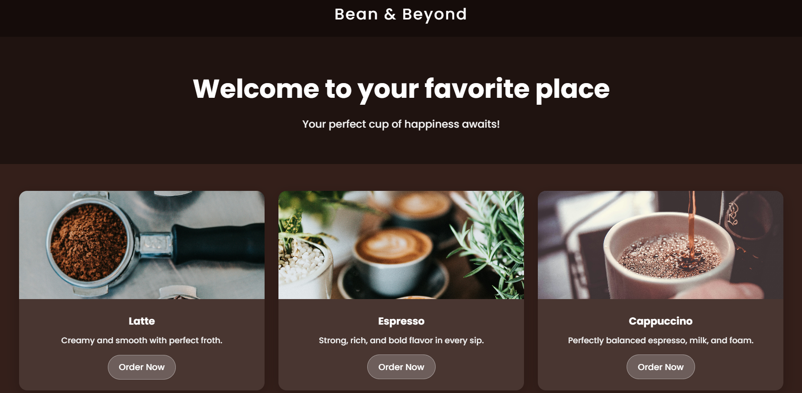

# bean-and-beyond 

A cozy & modern coffee café website built with **HTML** + **CSS** only.  
Simple, aesthetic, and perfect for beginners learning web design.

---

## ✨ Features
- 📱 **Responsive** – Looks great on all devices  
- 💎 **Glassmorphism** – Sleek, modern menu cards  
- 🎨 **Customizable** – Change images, text, and colors easily  
- 🎯 **Pure HTML & CSS** – No frameworks, no JavaScript  

---

## 📂 Structure
coffee-cafe/
├── index.html # Website structure
├── style.css # Styling & animations
└── README.md # Documentation

---

## 🚀 Quick Start
1. Download or clone this repo  
2. Open `index.html` in your browser  
3. Sip your coffee & enjoy ☕  

---

## 🖼 Preview

---

## 📜 License
Free to use & customize. Images from [Unsplash](https://unsplash.com).

---
Made with ❤️ + ☕
